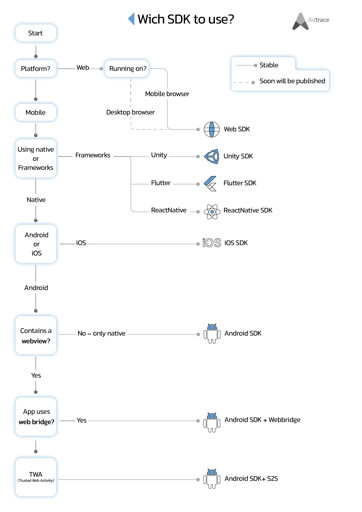

<p align="center"><a href="https://adtrace.io" target="_blank" rel="noopener noreferrer"></a></p>  
<p align="center">  
  <a href='https://opensource.org/licenses/MIT'></a>  
</p>

English,[فارسی](./README_PERSIAN.md)

# Which SDK to use in your project?

<p align="center">
<a href="https://adtrace.io" target="_blank" rel="noopener noreferrer">

</a></p>  


## Links to Official Documentations

- Native
     - [android SDK + Web bridge](https://github.com/adtrace/adtrace_sdk_android)
     - [iOS SDK](https://github.com/adtrace/adtrace_sdk_iOS)
- Frameworks
     - [Flutter SDK](https://github.com/adtrace/adtrace_sdk_flutter)
     - [React Native SDK](https://github.com/adtrace/adtrace_sdk_react_native)
     - [Unity SDK](https://github.com/adtrace/adtrace_sdk_unity)
- Web
  - [Web SDK](https://github.com/adtrace/adtrace_sdk_web)

# **Technical support**
If you have any technical question please review closed issues or submit a new **issue** in the corresponding repository. our technical support is available ASAP (usually less than 24 hours).
<p align="center">
<a href="https://adtrace.io" target="_blank" rel="noopener noreferrer">

</a></p>


- Native
     - [android issues](https://github.com/adtrace/adtrace_sdk_android/issues)
     - [iOS issues](https://github.com/adtrace/adtrace_sdk_iOS/issues)
- Frameworks
     - [Flutter issues](https://github.com/adtrace/adtrace_sdk_flutter/issues)
     - [React Native issues](https://github.com/adtrace/adtrace_sdk_react_native/issues)
     - [Unity issues](https://github.com/adtrace/adtrace_sdk_unity/issues)
- Web
  - [Web issues](https://github.com/adtrace/adtrace_sdk_web/issues)
  

# Adtrace Event 
You can use the Adtrace SDK to track event information (for example when user clicks on a button) by associating an event with an event token. To do this, you will need to create event tokens for each event you want to track in the Adtrace Panel.
You can also use event tracking to track revenue-generating actions in your app (including engagements and in-app purchases). if you need to attach other information (e.g. user data associated with the event) to the event object as `key`,`value` pairs.
<p align="center">
<a href="https://adtrace.io" target="_blank" rel="noopener noreferrer">

</a></p>


# How Tracker Works
Adtrace trackers are your foundation for campaign tracking. Use tracker URLs to:
-  Link users to your app in the appropriate app store.
-  Record user engagement with ads.
-  Segment users by attribution source.
-  Redirect users based on device type.

Your trackers can live wherever there is engagement with your campaign media. For example, in-app advertisements, emails, search engine results, social media posts, mobile websites, on connected TV, and more. The placement of the actual tracker URL depends on what advertising channel you use. In Adtrace, there are different types of tracker. The two most common are `click` trackers and `impression` trackers. These can be used in any type of mobile or web campaign and can be created and edited in The Adtrace Panel. all changes are published simultaneously!
<p align="center">
<a href="https://adtrace.io" target="_blank" rel="noopener noreferrer">

</a></p>


# How Deferred deep linking works

<p align="center">
<a href="https://adtrace.io" target="_blank" rel="noopener noreferrer">

</a></p>


### ***Recommended issue template***
---
**Title**:  brief description of the issue in one sentence
----
*tell me what happened?*

- a simple description of the problem occurred.

> I can't send `event` with value. after calling `AdTrace.trackEvent()` an exception throws and etc.
> I also tried this and that
---
- error message you see (related to adtrace sdk)
**Note**: set AdTrace log level to `verbose` and search for `AdTrace` tag in logs for sdk logs too.
> this is the error i'm getting:
```java
java.io.IOException: Attempted read from closed stream.
com.android.music.sync.common.SoftSyncException: java.io.IOException: Attempted read from closed stream.
    at com.android.music.sync.google.MusicSyncAdapter.getChangesFromServerAsDom(MusicSyncAdapter.java:545)
    at com.android.music.sync.google.MusicSyncAdapter.fetchDataFromServer(MusicSyncAdapter.java:488)
    at com.android.music.sync.common.AbstractSyncAdapter.download(AbstractSyncAdapter.java:417)
    at com.android.music.sync.common.AbstractSyncAdapter.innerPerformSync(AbstractSyncAdapter.java:313)
    at com.android.music.sync.common.AbstractSyncAdapter.onPerformLoggedSync(AbstractSyncAdapter.java:243)
    at com.google.android.common.LoggingThreadedSyncAdapter.onPerformSync(LoggingThreadedSyncAdapter.java:33)
    at android.content.AbstractThreadedSyncAdapter$SyncThread.run(AbstractThreadedSyncAdapter.java:164)
Caused by: java.io.IOException: Attempted read from closed stream.
    at org.apache.http.impl.io.ChunkedInputStream.read(ChunkedInputStream.java:148)
    at org.apache.http.conn.EofSensorInputStream.read(EofSensorInputStream.java:159)
    at java.util.zip.GZIPInputStream.readFully(GZIPInputStream.java:212)
    at java.util.zip.GZIPInputStream.<init>(GZIPInputStream.java:81)
    at java.util.zip.GZIPInputStream.<init>(GZIPInputStream.java:64)
    at android.net.http.AndroidHttpClient.getUngzippedContent(AndroidHttpClient.java:218)
    at com.android.music.sync.api.MusicApiClientImpl.createAndExecuteMethod(MusicApiClientImpl.java:312)
    at com.android.music.sync.api.MusicApiClientImpl.getItems(MusicApiClientImpl.java:588)
    at com.android.music.sync.api.MusicApiClientImpl.getTracks(MusicApiClientImpl.java:638)
    at com.android.music.sync.google.MusicSyncAdapter.getChangesFromServerAsDom(MusicSyncAdapter.java:512)
    ... 6 more
```
---

- SDK version that you are using.
> Android SDK: v2.0.3 or Flutter SDK: v0.1.3 
for Flutter run `flutter doctor` and mention `environment: sdk` too
---

- Configuration of your tools

IDE examples:

> android studio 2021.1.2

> XCode 13.1

> ...

Mobile OS example:

> Android API level 31 / gradle version: 7.2.1

> iOS 15.4

Device Model example:

> Samsung Galaxy S9 (android 9) or (api level 28)

> iPhone 13 mini (iOS 15.4)

> emulator: pixel 4 (api level 32)

> simulator: iPhone 13 ( iOS 15
