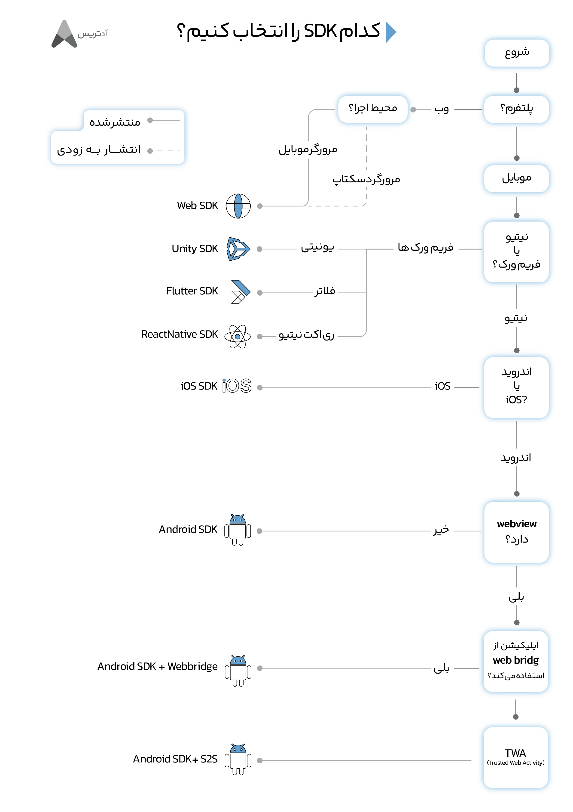
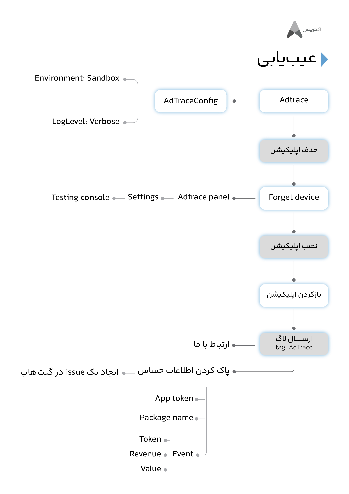
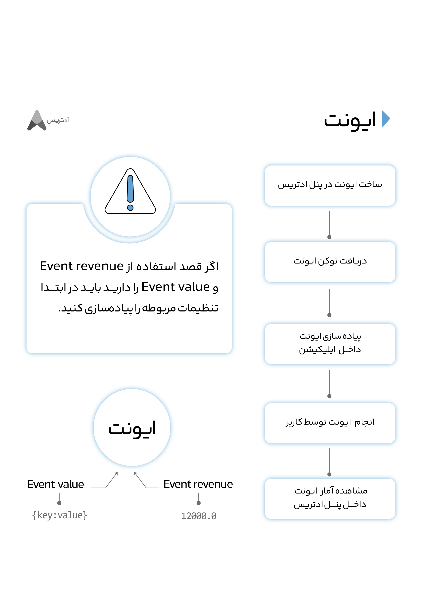
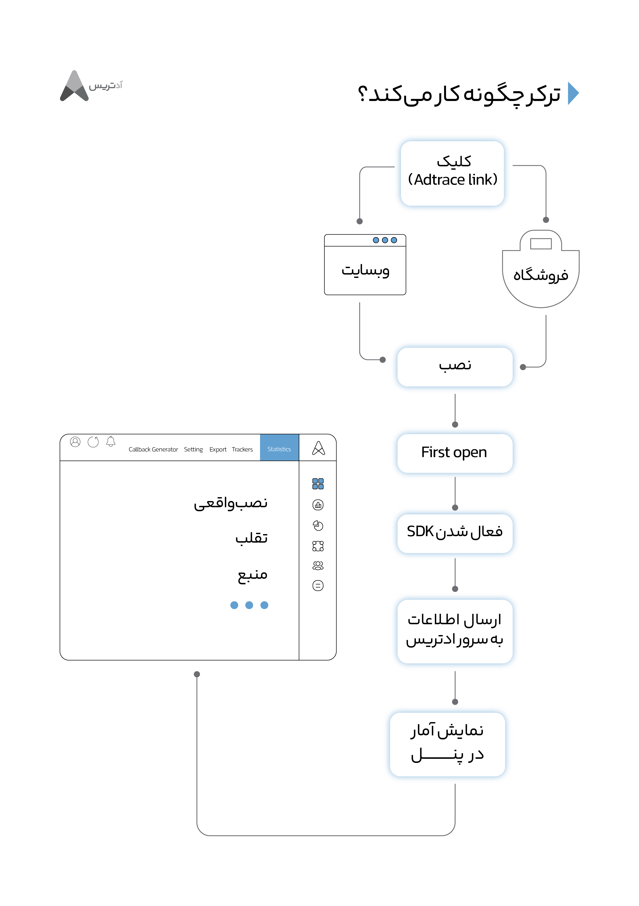
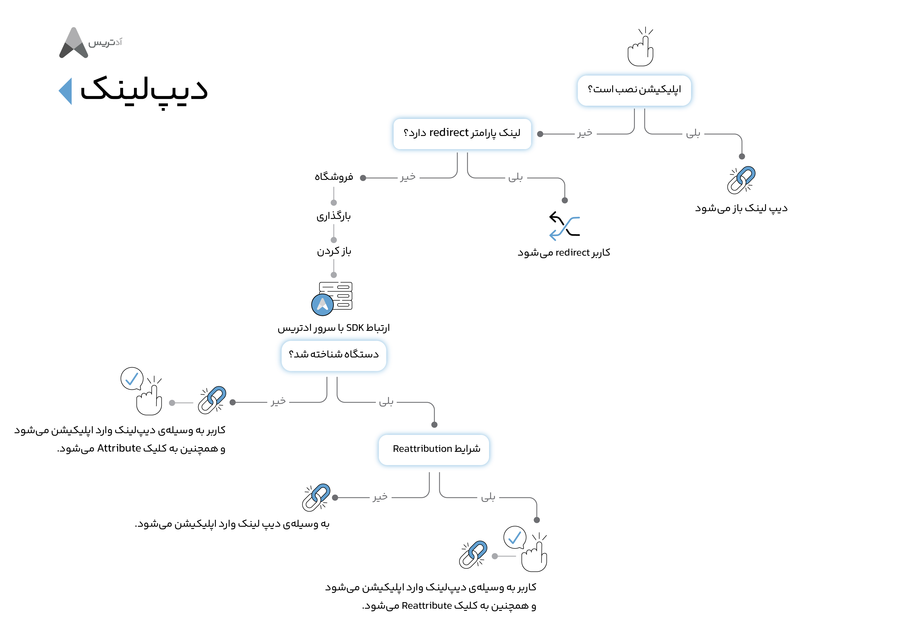

[English](./README.md),فارسی


## از کدام SDK در پروژه ام استفاده کنم؟

<p align="center">
<a href="https://adtrace.io" target="_blank" rel="noopener noreferrer">

</a></p>  


---
### لینک های مربوط به داکیومنت رسمی ادتریس
---
- Native
     - [android SDK + Web bridge](https://github.com/adtrace/adtrace_sdk_android)
     - [iOS SDK](https://github.com/adtrace/adtrace_sdk_iOS)
- Frameworks
     - [Flutter SDK](https://github.com/adtrace/adtrace_sdk_flutter)
     - [React Native SDK](https://github.com/adtrace/adtrace_sdk_react_native)
     - [Unity SDK](https://github.com/adtrace/adtrace_sdk_unity)
- Web
  - [Web SDK](https://github.com/adtrace/adtrace_sdk_web)


---
### [جدید]سوالات پرتکرار
---
- Native
     - [android](./files/FAQs/android-native-faq-en.md)  
     - [Web bridge](./files/FAQs/webbridge-faq.md)  
     - [iOS](./files/FAQs/ios-native-faq-en.md)  
- Frameworks
     - [Flutter](./files/FAQs/flutter-faq-en.md)  
     - [React Native](./files/FAQs/react-native-faq-en.md)  
     - [Unity](./files/FAQs/unity-faq-en.md)  
- Web
  - [Web](./files/FAQs/web-faq-en.md)  

---
### [جدید]راهنمای مهاجرت 
---
- Native
     - [android](./files/MigrationGuides/android.md)  
     - [iOS](./files/MigrationGuides/ios.md)  
- Frameworks
     - [Flutter](./files/MigrationGuides/flutter.md)  
     - [React Native](./files/MigrationGuides/reactnative.md)  
     - [Unity](./files/MigrationGuides/unity.md)  
- Web
  - [Web](./files/MigrationGuides/web.md)  

---
### پشتیبانی فنی
---
درصوتی که هرگونه مشکل فنی یا سوالی برای شما پیش آمد می توانید در بخش issue مربوط به هرکدام از repository ها مطرح کنید. می توانید issue بسته شده را در صورت نیاز باز کنید. همکاران ما در کوتاه ترین زمان (کمتر از ۲۴ ساعت) رسیدگی خواهند کرد.

<p align="center">
<a href="https://adtrace.io" target="_blank" rel="noopener noreferrer">

</a></p>

- Native
     - [android issues](https://github.com/adtrace/adtrace_sdk_android/issues)
     - [iOS issues](https://github.com/adtrace/adtrace_sdk_iOS/issues)
- Frameworks
     - [Flutter issues](https://github.com/adtrace/adtrace_sdk_flutter/issues)
     - [React Native issues](https://github.com/adtrace/adtrace_sdk_react_native/issues)
     - [Unity issues](https://github.com/adtrace/adtrace_sdk_unity/issues)
- Web
  - [Web issues](https://github.com/adtrace/adtrace_sdk_web/issues)
  
  
  
---
### ایونت
---
با استفاده از ایونت می توانید از انجام شدن یک عمل توسط کاربر اپلیکیشن مطلع شوید. برای تعریف ایونت باید ایونت توکن را در آن قرار دهید. در پنل ادتریس می توانید به تعداد دلخواه ایونت تعریف کرده و توکن مربوط به هرکدام را دریافت کنید و در جای لازم جایگذاری کنید. 
همچنین می توانید میزان درآمد حاصل را نیز به همراه ایونت ارسال کنید. در صورتی لزوم نیز می توانید اطلاعات بیشتری به ایونت اضافه کرده (به صورت key,value)و ارسال نمایید.
<p align="center">
<a href="https://adtrace.io" target="_blank" rel="noopener noreferrer">

</a></p>


---
### ترکر چگونه کار می کند؟
---

<p align="center">
<a href="https://adtrace.io" target="_blank" rel="noopener noreferrer">

</a></p>
ترکر ادتریس اساس ارزیابی کمپین های تبلیغاتی شما هستند. برخی از استفاده های ترکر عبارت اند از:

- هدایت کردن کاربر به استور مشخص شده 
- محاسبه میزان تعامل کاربر با تبلیغات انجام شده
- دسته بندی کاربران با توجه به منبع نصب
- هدایت کاربران با توجه به نوع و سیستم عامل دستگاه

تا زمانی که کمپین شما درحال فعالیت است ترکر فعال خواهد بود. تبلیغات درون برنامه ای٫ ایمیل ٫ تبلیغات شبکه های اجتماعی ٫ سایت های مختلف و حتی تلویزیون های متصل به اینترنت مثال هایی از این دست هستند.

اینکه از کدام لینک ترکر استفاده کنید به نوع تبلیغ و کانال تبلیغاتی شما بستگی دارد. ادتریس ترکرهای مختلفی را ارائه می دهد. مهم ترین آنها **کلیک** و **ایمپرشن** (`click`, `impression`) هستند. این ترکرها در هرنوعی تبلیغ صرف نظر از اینکه روی موبایل باشند یا در صفحه دسکتاپ٫ قابل ایجاد و ویرایش در هرزمانی هستند. با مراجعه به پنل ادتریس هر کاری که مایل هستید روی آن ها انجام دهید و تغییرات را به صورت آنی ببینید!


---
### دیفرد دیپ لینک چگونه کار می کند؟
---

<p align="center">
<a href="https://adtrace.io" target="_blank" rel="noopener noreferrer">

</a></p>

                                                          
### ***روش پیشنهادی برای ایجاد issue***
---
**Title**: توصیف کوتاه مسئله در حد یک جمله
----
*توضیح دهید چه اتفاقی رخ داده است؟*

- توصیف کوتاهی از مسئله و رفتار مورد انتظاری که اتفاق نمی افتد.

> I can't send `event` with value. after calling `AdTrace.trackEvent()` an exception throws and etc.
> I also tried this and that
---
- خطایی که مشاهده می کنید (مربوط به ادتریس باشد)
**توج**: هنگام تست کردن در config ادتریس مقدار log level را بر روی verbose تنظیم کنید تا گزارش رفتار کامل ادتریس را مشاهده کنید.
> this is the error i'm getting:
```java
java.io.IOException: Attempted read from closed stream.
com.android.music.sync.common.SoftSyncException: java.io.IOException: Attempted read from closed stream.
    at com.android.music.sync.google.MusicSyncAdapter.getChangesFromServerAsDom(MusicSyncAdapter.java:545)
    at com.android.music.sync.google.MusicSyncAdapter.fetchDataFromServer(MusicSyncAdapter.java:488)
    at com.android.music.sync.common.AbstractSyncAdapter.download(AbstractSyncAdapter.java:417)
    at com.android.music.sync.common.AbstractSyncAdapter.innerPerformSync(AbstractSyncAdapter.java:313)
    at com.android.music.sync.common.AbstractSyncAdapter.onPerformLoggedSync(AbstractSyncAdapter.java:243)
    at com.google.android.common.LoggingThreadedSyncAdapter.onPerformSync(LoggingThreadedSyncAdapter.java:33)
    at android.content.AbstractThreadedSyncAdapter$SyncThread.run(AbstractThreadedSyncAdapter.java:164)
Caused by: java.io.IOException: Attempted read from closed stream.
    at org.apache.http.impl.io.ChunkedInputStream.read(ChunkedInputStream.java:148)
    at org.apache.http.conn.EofSensorInputStream.read(EofSensorInputStream.java:159)
    at java.util.zip.GZIPInputStream.readFully(GZIPInputStream.java:212)
    at java.util.zip.GZIPInputStream.<init>(GZIPInputStream.java:81)
    at java.util.zip.GZIPInputStream.<init>(GZIPInputStream.java:64)
    at android.net.http.AndroidHttpClient.getUngzippedContent(AndroidHttpClient.java:218)
    at com.android.music.sync.api.MusicApiClientImpl.createAndExecuteMethod(MusicApiClientImpl.java:312)
    at com.android.music.sync.api.MusicApiClientImpl.getItems(MusicApiClientImpl.java:588)
    at com.android.music.sync.api.MusicApiClientImpl.getTracks(MusicApiClientImpl.java:638)
    at com.android.music.sync.google.MusicSyncAdapter.getChangesFromServerAsDom(MusicSyncAdapter.java:512)
    ... 6 more
```
---

- نسخه اس دی کی که در پروژه خود استفاده می کنید.
> Android SDK: v2.0.3 or Flutter SDK: v0.1.3 
for Flutter run `flutter doctor` and mention `environment: sdk` too
---

- ابزارهایی که استفاده می کنید

IDE مثال:

> android studio 2021.1.2

> XCode 13.1

> ...

Mobile OS مثال:

> Android API level 31 / gradle version: 7.2.1

> iOS 15.4

Device Model مثال:

> Samsung Galaxy S9 (android 9) or (api level 28)

> iPhone 13 mini (iOS 15.4)

> emulator: pixel 4 (api level 32)

> simulator: iPhone 13 ( iOS 15
